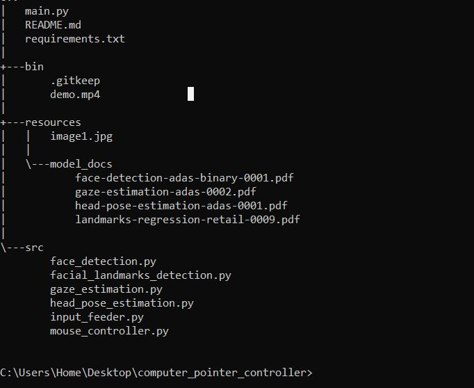
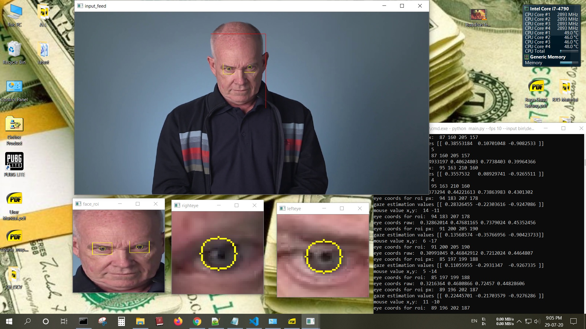
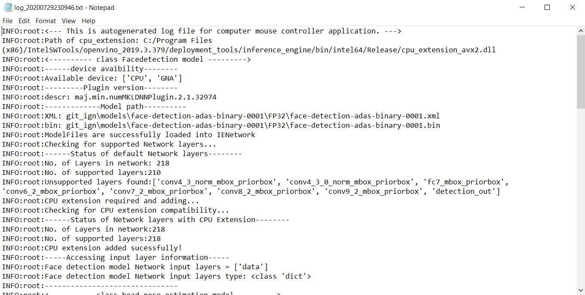
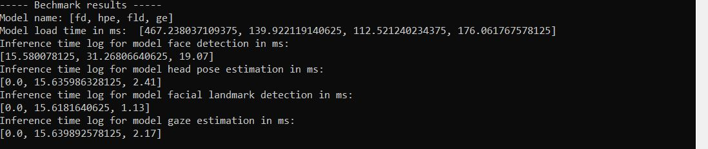

[](https://opensource.org/licenses/Apache-2.0) [](https://www.python.org/)

| Details            |              |
|-----------------------|---------------|
| Programming Language: |  Python 3.5 or 3.6 |


# Computer Pointer Controller
This project performs inference on multiple model and demostrated the data flow between them using openvino toolkit. Total four model has been utilized to automatically controll the mouse using face and eye directions.


**features:**
- Four model inference simultaniously.
- Toggle to show all the intermidiate netwok outputs by -sdo command.
- Auto identifiying the supported layers informations and adds cpu extension if required.
- Detects face, left eye, right eye, it can be recomfigurable for nose and mouth detection.
- Selectable inputs: image, local video or live cam.
- Autogenerated log file for critical events and errors.
- Benchmarks the model load time and inference time for each models.

**Limitation**
- Not for multiple faces.
- Calibration not implemented for mouse movement with respect to resolution


For more detail , use -h argument:

```
usage: main.py [-h] -fd FD [-pt_fd PROB_THRESHOLD_FD] -hpe HPE
               [-pt_hpe PROB_THRESHOLD_HPE] -fld FLD
               [-pt_fld PROB_THRESHOLD_FLD] -ge GE [-pt_ge PROB_THRESHOLD_GE]
               -i INPUT [-fps FPS] [-l CPU_EXTENSION] [-d DEVICE]
               [-tv TOGGLE_VIDEO] [-ci CAM_ID] [-sdo SHOW_DEBUG_OUTPUT]

optional arguments:
  -h, --help            show this help message and exit
  -fd FD, --fd FD       Path to an xml file of face detection model.
  -pt_fd PROB_THRESHOLD_FD, --prob_threshold_fd PROB_THRESHOLD_FD
                        Probability threshold for face detections
                        filtering(0.5 by default)
  -hpe HPE, --hpe HPE   Path to an xml file of head pose estimation model.
  -pt_hpe PROB_THRESHOLD_HPE, --prob_threshold_hpe PROB_THRESHOLD_HPE
                        Probability threshold for head pose estimation
                        filtering(0.5 by default)
  -fld FLD, --fld FLD   Path to an xml file of facial_landmarks_detection
                        model.
  -pt_fld PROB_THRESHOLD_FLD, --prob_threshold_fld PROB_THRESHOLD_FLD
                        Probability threshold for facial_landmarks_detection
                        filtering(0.5 by default)
  -ge GE, --ge GE       Path to an xml file of facial_landmarks_detection
                        model.
  -pt_ge PROB_THRESHOLD_GE, --prob_threshold_ge PROB_THRESHOLD_GE
                        Probability threshold for facial_landmarks_detection
                        filtering(0.5 by default)
  -i INPUT, --input INPUT
                        Path to image, video file or for webcam just type CAM
  -fps FPS, --fps FPS   FPS of Video or webcam, required to get perfect
                        duration calculations.
  -l CPU_EXTENSION, --cpu_extension CPU_EXTENSION
                        MKLDNN (CPU)-targeted custom layers.Absolute path to a
                        shared library with thekernels impl.
  -d DEVICE, --device DEVICE
                        Specify the target device to infer on: CPU, GPU, FPGA
                        or MYRIAD is acceptable. Sample will look for a
                        suitable plugin for device specified (CPU by default)
  -tv TOGGLE_VIDEO, --toggle_video TOGGLE_VIDEO
                        Toggle Video feed on or off [ON or OFF](on by default)
  -ci CAM_ID, --cam_id CAM_ID
                        input web Camera id(0 by default)
  -sdo SHOW_DEBUG_OUTPUT, --show_debug_output SHOW_DEBUG_OUTPUT
                        Toggle Video feed on or off [ON or OFF](on by default)
```

## Project Set Up and Installation
This can be used in main system or python virtual environment. For virtual environment refer requirements.txt file.

### Start virtual invironment WINDOWS10
```
venv_computer_pointer_control\Scripts\Activate
```
Here replace "venv_computer_pointer_control" with your virtual environment name.

## Requirements

### Hardware

* 6th to 10th generation Intel® Core™ processor with Iris® Pro graphics or Intel® HD Graphics.
* OR use of Intel® Neural Compute Stick 2 (NCS2)
* OR Udacity classroom workspace for the related course

### Software

*   Intel® Distribution of OpenVINO™ toolkit 2019 R3 release
*   python virtual environment if required
*   Web-cam


### External dependencies
Following python dependencies are required.
- pyautogui
- numpy
- Opencv >=V3.x

### Running the code
To run the code make sure all the four pre trained intel model downloaded in to one directory.

Now run the following code in the directory where main.py located. Make sure your command prompt located within the same directory. Change the model path accordingly.


### Run without live outputs and debugging

**For local video**
```
python main.py --input bin\demo.mp4 --fd yourpath\face-detection-adas-binary-0001.xml --hpe yourpath\head-pose-estimation-adas-0001.xml --fld yourpath\landmarks-regression-retail-0009.xml --ge yourpath\gaze-estimation-adas-0002.xml

```
**For web-cam**
```
python main.py --input CAM --fd yourpath\face-detection-adas-binary-0001.xml --hpe yourpath\head-pose-estimation-adas-0001.xml --fld yourpath\landmarks-regression-retail-0009.xml --ge yourpath\gaze-estimation-adas-0002.xml
```
### Run with live outputs and debugging

**For local video**
```
python main.py --input bin\demo.mp4 --fd yourpath\ace-detection-adas-binary-0001.xml --hpe yourpath\head-pose-estimation-adas-0001.xml --fld yourpath\landmarks-regression-retail-0009.xml --ge yourpath\gaze-estimation-adas-0002.xml -sdo ON
```
**For web-cam**
```
python main.py --input CAM --fd yourpath\face-detection-adas-binary-0001.xml --hpe yourpath\head-pose-estimation-adas-0001.xml --fld yourpath\landmarks-regression-retail-0009.xml --ge yourpath\gaze-estimation-adas-0002.xml -sdo ON
```

### Project directory structure



## Demo

**With debuggin each model intermidiate outputs**



**Auto generated log**



**Bechmarking[min max avg]**



## Documentation
Total four argument for seperate model and their probability threshold are implemented.

1. Face detection: --fd
2. head pose estimation: --hpe
3. facial landmarks detection: --fld
4. gaze estimation: -ge

similarly you can define probability threshold explicitly.

1. Face detection: --prob_threshold_fd
2. head pose estimation: --prob_threshold_hpe
3. facial landmarks detection: --prob_threshold_fld
4. gaze estimation: ----prob_threshold_ge


## Benchmarks:

Benchmark was performed on loca system:
- OS: Windows 10 V2004
- CPU: Intel I7 4790 @2.8Ghz
- RAM: 8GB

### For FP32

model name | Model load time in ms.| Inference time in ms. [Min Max avg.]
-----------|------------------------|-------------------------------------
face-detection-adas-binary-0001| 453.078 | [15.60, 31.2587890625, 18.13]
head-pose-estimation-adas-0001 | 151.304 | [0.0, 15.62, 1.89]
landmarks-regression-retail-0009 | 102.931 | [0.0, 15.61, 0.79]
gaze-estimation-adas-0002 | 171.878 | [0.0, 15.64, 2.65]


### For FP16

model name | Model load time in ms. | Inference time in ms. [Min Max avg.]
-----------|------------------------|-------------------------------------
face-detection-adas-binary-0001| N/A  | N/A
head-pose-estimation-adas-0001 | 160.835 | [0.0, 15.62, 1.85]
landmarks-regression-retail-0009 |  108.187 | [0.0, 15.61, 1.32]
gaze-estimation-adas-0002 |  187.472 | [0.0, 15.63, 1.32]

### For INT8

model name | Model load time in ms. | Inference time in ms. [Min Max avg.]
-----------|------------------------|-------------------------------------
face-detection-adas-binary-0001| N/A | N/A
head-pose-estimation-adas-0001 |  N/A |  N/A
landmarks-regression-retail-0009 |  N/A |  N/A
gaze-estimation-adas-0002 |  189.994 | [0.0, 15.63, 3.93]

## Results
*TODO:* Discuss the benchmark results and explain why you are getting the results you are getting. For instance, explain why there is difference in inference time for FP32, FP16 and INT8 models.

### Edge Cases
- This project can be utilized to identigy and alert sleeping drivers in trucks, cars and buses etc.
- This project can be deployed on edge if proper hardware selected which is optimized for FP16 based model. Since requirement of face detection can also be fulfilled with other alogrith for faster outputs and then feed the roi to next three model which are edge friendly.